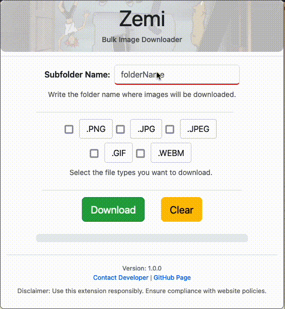
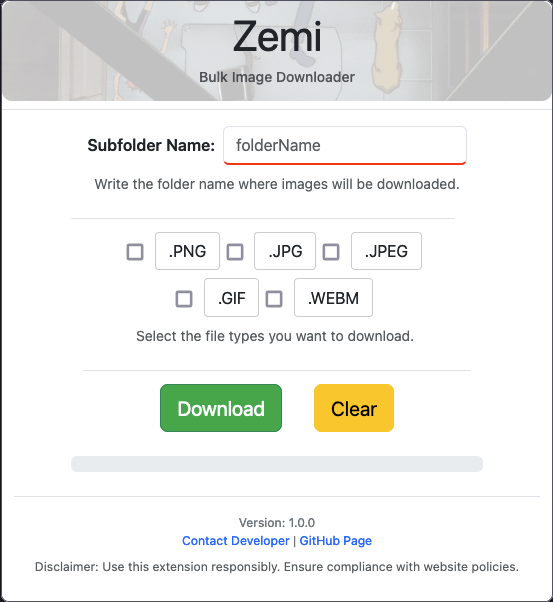
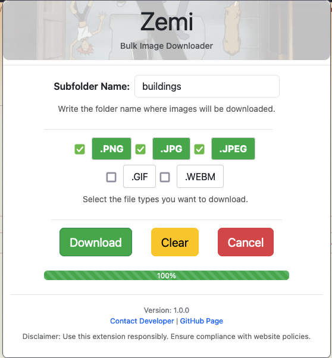

# Zemi - Bulk Image Downloader Extension

Zemi is a browser extension that allows you to download images in bulk from message boards or websites. Designed to be simple to use and easy on memory, Zemi supports selecting file type, folder specification, and progress tracking. 

---

## Features

### **1. Bulk Image Download**
- Easily download multiple images from a website with one click.
- Supports popular file formats such as `.png`, `.jpg`, `.jpeg`, `.gif`, and `.webm`.
- Supports specifying download folder location.
    - folders can contain multiple words, this doesn't cause errors as browsers handle this.

### **2. Download Management**
- **Progress Tracking**: View real-time progress using a dynamic progress bar.
- **Cancelation Support**: Cancel ongoing downloads directly from the popup interface.
- **No duplicates**: Prevent duplicate downloads using efficient hash-based file tracking.

### **3. Cross-Page Integration**
- Zemi works seamlessly on active tabs, injecting scripts dynamically for DOM interaction.

---

## How It Works

### **User Interface**
The user interface is presented as a popup with the following components:
- **Folder Input Field**: Specify the subfolder for downloads.
- **File Type Checkboxes**: Select the image formats you want to download.
- **Buttons**:
  - **Download**: Start the download process.
  - **Clear**: Reset all inputs.
  - **Cancel**: Stop the ongoing downloads.
    - this button is available when download starts.

### **Background Logic**
- Handles communication between the popup and the active tab.
- Injects the content script (`zemi.js`) to process DOM elements and gather image links.
- Tracks and manages downloads, ensuring efficiency and avoiding duplicates.

---

## Installation

1. Clone or download the repository.
2. Open your browser and navigate to the **Extensions** page:
   - For Chrome: `chrome://extensions/` --> **Porting is a work in progress will update in the future**
   - For Firefox: `about:addons`
3. Enable **Developer Mode** (Chrome) or load a temporary add-on (Firefox).
4. Click **Load Unpacked** (Chrome) or **Load Temporary Add-on** (Firefox) and select the downloaded folder.

---

## Usage

1. Open Zemi from the browser toolbar.
2. Enter the folder name for saving downloads.
3. Select the image file types you want to download.
4. Click the **Download** button to start the process.
5. Track progress in the progress bar. Cancel ongoing downloads if necessary.

**Note**: The extension as of version 1.0.0 relies on the downloads API to track the downloads this means that if you click away from the extension popup or go to another tab, there will be no UI persistance on the downloads within the popup. This does not mean that the downloads will stop downloading it just means you wont be able to track progress.
- This can be fixed by haivng a progress persistance within the zemi.js injected in the active tab.
- Furthermore this introcused a potential problem where you might not be able to cancel cerain downloads if you've run the extension in more active tabs.

**Suggestion**: Click the 'Download' button and let the downloads finish before moving on to another tab. If you are absolutelly sure that you want to download all the images and will not cancel them for any reason then you can use the extension however you want. 

---

## Screenshots / Demos

<br>




---

## File Structure

- **`manifest.json`**: Defines extension metadata and permissions.
- **`popup.js`**: Controls popup interactions and sends messages to the background script.
- **`content_script.js`**: Injected into active tabs to process DOMs and extract image links.
- **`background.js`**: Manages extension lifecycle, handles downloads, and ensures deduplication.

---

## Permissions

Zemi requires the following permissions:
- **Tabs**: To access active tabs for DOM injection.
- **Scripting**: To inject and execute scripts in web pages.
- **Downloads**: To manage and track image downloads.
- **Storage**: To save persistent download metadata.

---

## Development

1. Clone the repository:
   ```bash
   git clone https://github.com/BBoushe/zemi.git
   ```
2. Make changes to the files as needed.
3. Reload the extension in your browser to test updates.

---

## Disclaimer

Use Zemi responsibly and ensure compliance with website policies and copyright laws. Unauthorized scraping or downloading may violate terms of service.

---

## Contact

- **Developer**: [BBoushe](mailto:bboushe@yahoo.com)
- **GitHub**: [Zemi Repository](https://github.com/BBoushe/zemi)

---

Feel free to contribute to this extension.